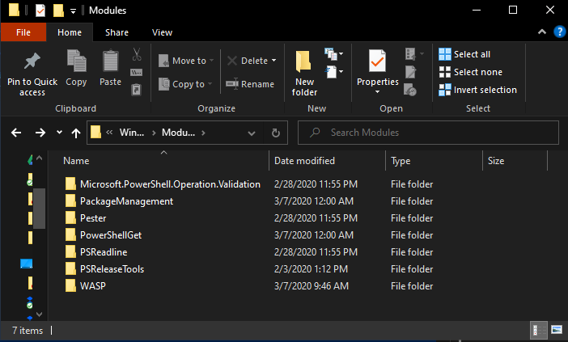
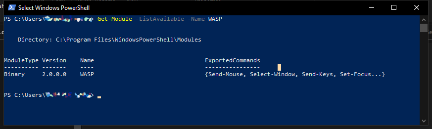

# How to install WASP as module in PowerShell

This is an instructional summary of how to install the WASP as a module. Adapted from Robert Allen's tutorial on Active Directory Pro.<sup>[1](#allen)</sup>

## Step 1: Choose your module install path

Install new modules in a path that is listed in the `PSModulePath` environment variable. To see the value of `PSModulePath` run the following command.

```powershell
$env:PSModulePath | Split-String -Separator ';'
```

Here is the result of running that command on my computer. You should see similar results.

[](powershell-env2.png)

There may be several paths listed but there are two main paths you should use, they are:

1. `$env:USERPROFILE`\Documents\WindowsPowerShell\Modules\
2. `$env:ProgramFiles`\WindowsPowerShell\Modules\\&lt;Module📁&gt;\\&lt;Module📃📄's&gt;

Use the first path if you want the module to be available for a specific user. Use the second path to make the module available for all users.

What are the other paths for?

The path below is reserved for modules that ship with Windows. Microsoft recommends not using this location.


```powershell
$PSHome\Modules
```


```cmd
%Windir%\System32\WindowsPowerShell\v1.0\Modules
```

You can also add your own paths, but unless you have a specific need, just stick with the two listed.

If you see other paths listed in your environment variable, it may be from programs you have installed. Some programs will automatically add PowerShell commands to the variable after installation.

Now that we know where to put new modules, let's move to step 2.

## Step 2: Copy new module to path

The next step is to copy WASP into one of the two paths identified in [step 1](#step-1-determine-the-install-path). Here, we'll make it available to all users by copying it to the `$env:ProgramFiles` destination

`C:\Program Files\WindowsPowerShell\Modules`

[](modules.png)

There it is. Just copy and paste the module into the path.

Now let’s verify the new module is visible to PowerShell, run the following command:

```powershell
Get-Module -ListAvailable
```

This command will check the paths that are set in the environment variable for modules.

The screenshot below is what returns when I run this command. I can see that the new module (WASP) is now visible to PowerShell.

[](listed.png)

Now that the new module is installed we still have one final step before we can use the new commands.

## Step 3: Import new module

Importing loads the module into active memory so that we can access the module in our session.

To import run the following command

```powershell
Import-Module -name WASP
```

That will do it, the new module is now ready to use.

<a name="allen">1</a>:
Allen, Robert. “How to Install PowerShell Modules.” Active Directory Pro, Active Directory Pro, 9 June 2018, activedirectorypro.com/install-powershell-modules/.