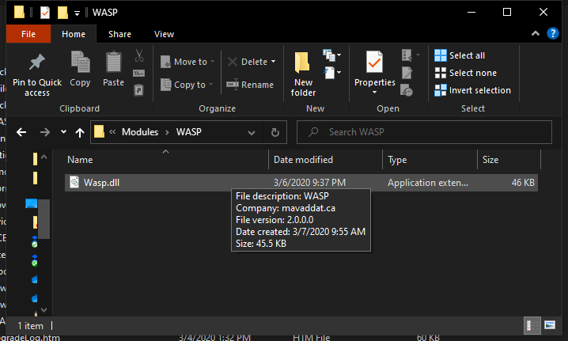

# How to install WASP as module in PowerShell

This is an instructional summary of how to install the WASP as a module. This brief has been adapted from Robert Allen's tutorial on Active Directory Pro.<a name="one"></a><sup>[1](#allen)</sup>

 1. [Choose your module install path](#step-1-choose-your-module-install-path)
 2. [Ensure DLL is in the WASP directory](#step-2-ensure-dll-is-in-the-wasp-directory)
 3. [Copy WASP DLL to module path and unblock it](#step-3-copy-wasp-dll-to-module-path-and-unblock-it)
 4. [Import new module](#step-4-import-new-module)

## Step 1: Choose your module install path

Install the new module by creating a directory named `WASP` in one of the paths that are listed in the `PSModulePath` environment variable.  (Or, you can move the directory `WASP` created by archive expansion in one of those paths.) To see the value of `PSModulePath` run the following command.

```powershell
$env:PSModulePath -split ';'
```

Here is the result of running that command on my computer (you should see similar results).

[](powershell-env2.png)

There may be several paths listed but there are <a id="two_safe_paths">**two safe paths**</a> you should use, they are:

1. `$env:USERPROFILE`\Documents\WindowsPowerShell\Modules\
2. `$env:ProgramFiles`\WindowsPowerShell\Modules\\&lt;Module📁&gt;\\&lt;Module📃📄's&gt;

Use the first of the above paths if you want the module to be available for a *specific user*. Use the second path to make the module available for *all users*.

What are the other paths for?

| The path below is reserved for modules that ship with Windows. **&#9888; Warning:** Microsoft recommends not using this location.<a name="two"></a><sup>[1](#install-modules-in-psmodulepath) |
| --- |
| <br/><pre lang="powershell">$PSHome\Modules</pre> |
|  <br/><pre lang="cmd">%Windir%\System32\WindowsPowerShell\v1.0\Modules</pre> |
| You can also add your own paths, however, unless you have a specific need, just stick with [the two safe paths listed](#two_safe_paths). |

If you see other paths listed in your environment variable, it may be from programs you have installed. Some programs will automatically add PowerShell commands to the variable after installation.

Now that we know where to put new modules, let's move to step 2.

## Step 2: Ensure DLL is in the WASP directory

Check that you have the `WASP.dll` from [the releases](/releases) in the `WASP` module directory.



## Step 3: Copy directory with WASP DLL to module path and unblock DLL

The next step is to copy the directory `WASP` containing the `WASP.dll` into one of the two paths identified in [step 1](#step-1-determine-the-install-path). Here, we'll make it available to all users by copying it to the `$env:ProgramFiles` destination

`C:\Program Files\WindowsPowerShell\Modules`

[](modules.png)

There it is. Copy and paste or extract the module into the path (within a directory named `WASP`).

We also need to [ask Windows to unblock](https://docs.microsoft.com/en-us/powershell/module/microsoft.powershell.utility/unblock-file) the DLL, since the file is originally downloaded from the Internet.

```powershell
Unblock-File -Path "$env:ProgramFiles\WindowsPowerShell\Modules\WASP\WASP.dll"
```

Now let’s verify the new module is visible to PowerShell, run the following command:

```powershell
Get-Module -ListAvailable
```

This command will check the paths that are set in the environment variable for modules.

The screenshot below is what returns when I run this command. I can see that the new module (`WASP`) is now visible to PowerShell.

[](listed.png)

Now that the new module is installed we still have one final step before we can use the new commands.

## Step 4: Import new module

Importing loads the module into active memory so that we can access the module in our session.

To import run the following command

```powershell
Import-Module -name WASP
```

That will do it &mdash; the WASP module is now ready to use.

| Here's a one-liner to import `WASP` if it is available: |
|---|
|  
```powershell
if(Get-InstalledModule -Name WASP -ErrorAction Ignore) {Get-Module -ListAvailable -Name WASP | Import-Module} else {Write-Host "You need to install the module first. See https://github.com/mavaddat/wasp/How_to_install_WASP_as_module_in_PowerShell.md" -ForegroundColor Red}
```
|

Did you run into a problem? If so, see the detailed instructions on Microsoft's docs website [here](https://docs.microsoft.com/en-us/powershell/scripting/developer/module/installing-a-powershell-module).

<a name="allen" href="one">&#11180;&nbsp;1</a>:
Allen, Robert. “How to Install PowerShell Modules.” Active Directory Pro, Active Directory Pro, 9 June 2018, activedirectorypro.com/install-powershell-modules/.

<a name="install-modules-in-psmodulepath" href="two">&#11180;&nbsp;2</a>:
Installing a PowerShell Module - PowerShell | Microsoft Docs https://docs.microsoft.com/en-us/powershell/scripting/developer/module/installing-a-powershell-module#install-modules-in-psmodulepath
